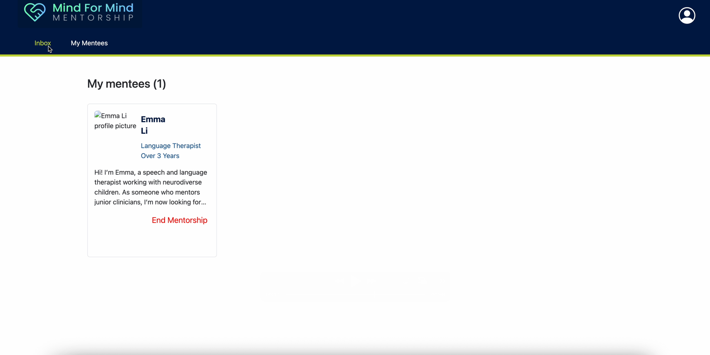
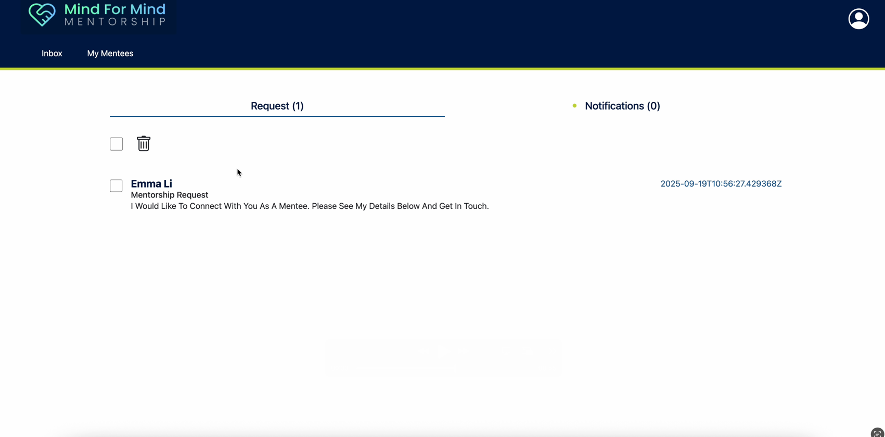
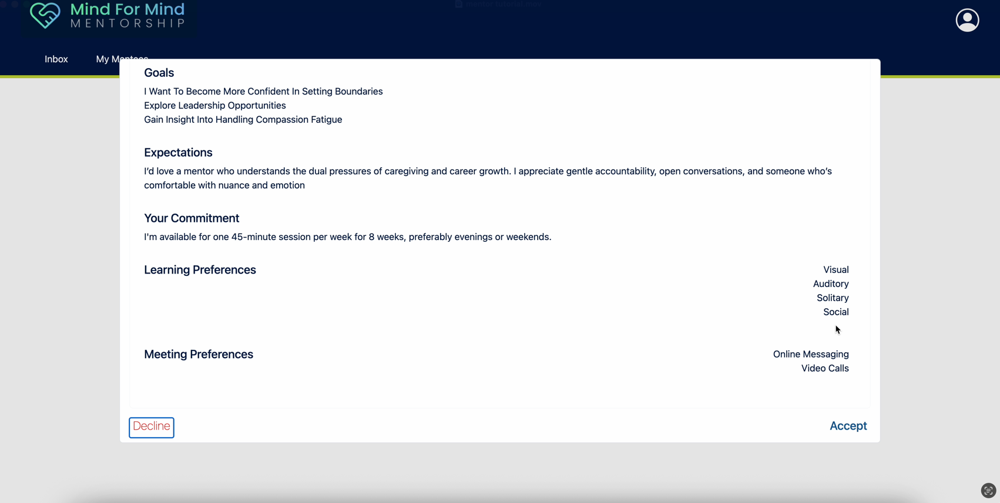
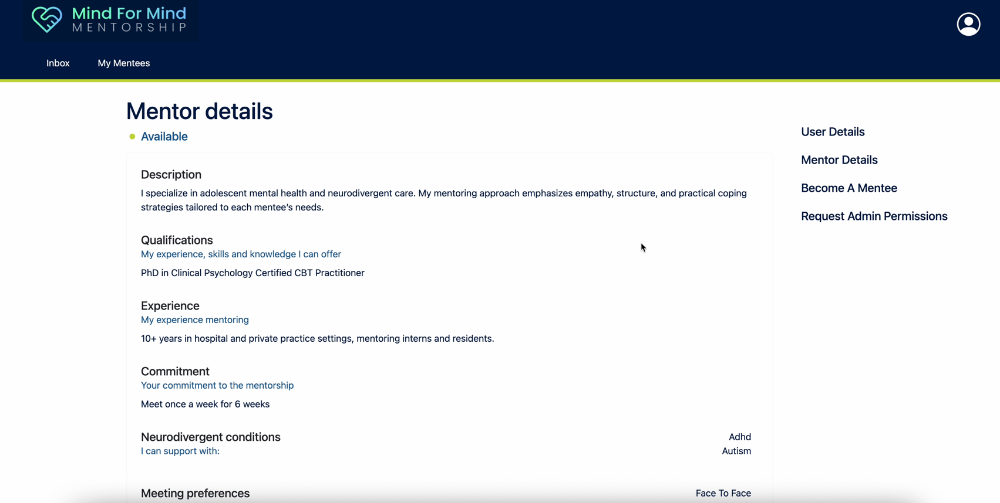
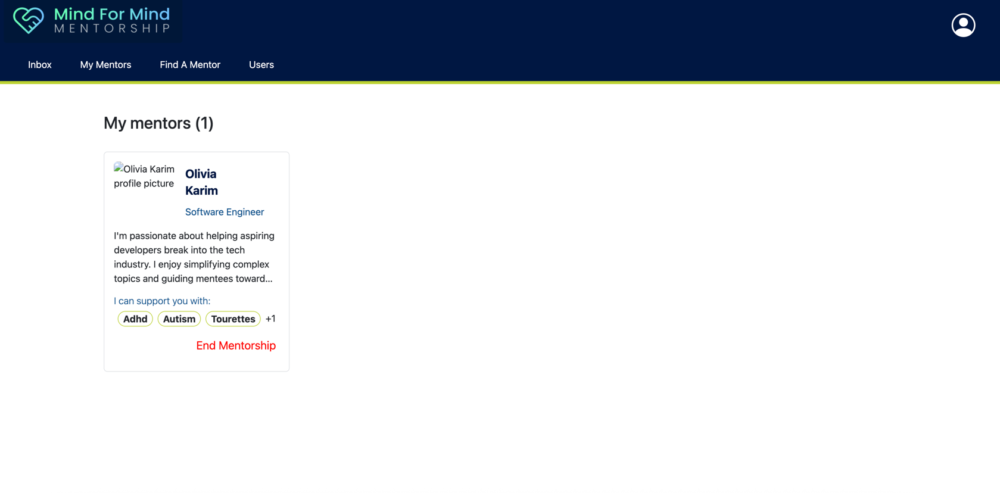
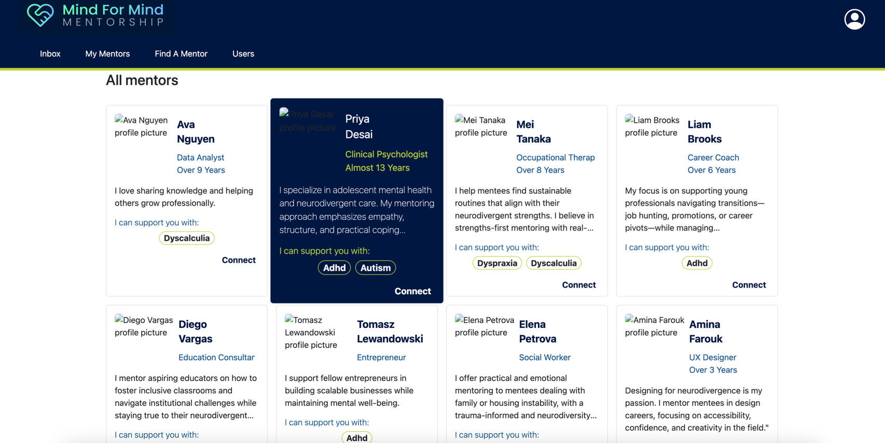
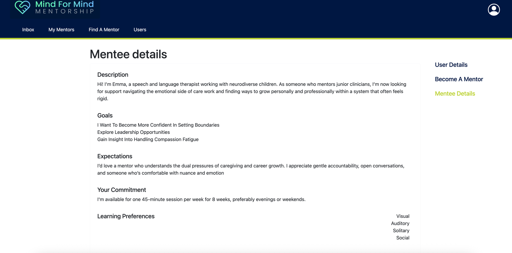

# Mind4MindsApp

Welcome to Minds for minds, the app that connects mentees to mentors with neurodiverse considerations.

Feel free to use the [production ready](https://mind-4-minds.web.app/) version of the app

## User rules
- User can update their details including email, name and passwords as long they remember their current password
- Only admins can reset passwords at this stage
- Can request to be an admin but this must be approved by an approved admin

## Mentor Tutorial
Mentors will receive request for mentorship from mentees and can:
- Accept the request
- Decline the request
- Ignore the request
- View the mentee's mentorship details
- End a mentorship with a mentee
- Remove themselves from the list of active mentors

[Watch the mentor tutorial](tutorials/mentor_tutorial.mov)

  
Click to see screenshots from a mentor's POV

The mentor's current mentees

The mentor's inbox

A mentorship request

Mentor details

## Mentee Tutorial

Mentees will search for mentors and make mentorship requests to mentors. They can also:

- View the mentor's mentorship details
- End a mentorship with a mentor

[Watch the mentee tutorial](tutorials/mentee_tutorial.mov)

  
Click to see screenshots from a mentee's POV

The mentee's current mentors

Mentee searching for a mentor

Mentee details

## Local Development
To run the app locally, you must have installed:
- Python 3
- Node.js
- Postgres

All admin requests must be approved by an approved admin user:
Here are the credentials for the local initial approved administrator:
- email: admin@admin.com
- password: admin@123

## Local Server
To run the application locally, run `npm run dev`

To the run the frontend locally, run the following commands in the terminal:
- `cd frontend`
- `ng serve` 

To run the backend locally, run the following commands in the terminal:
- `source venv1/bin/activate`
- `cd backend`
- `python manage.py runserver`

## Some features are currently not implemented
This includes:
- Notifications
- Emails

