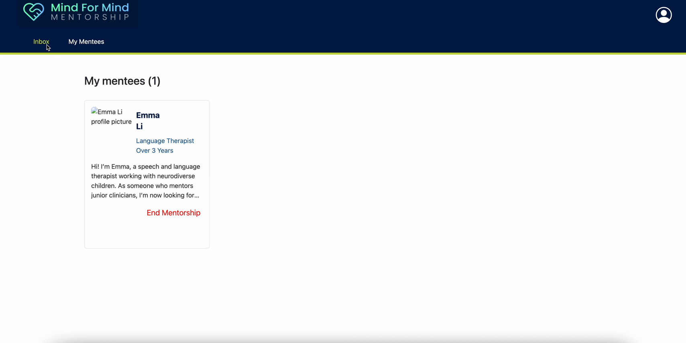
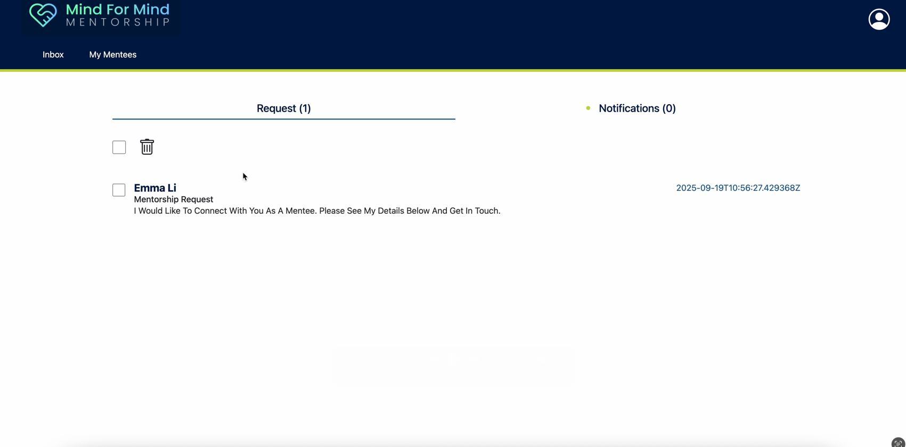
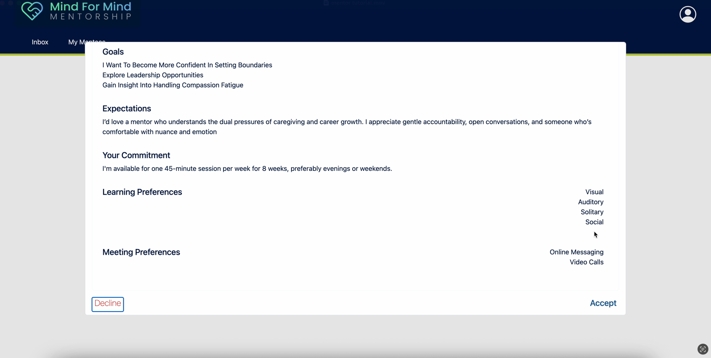
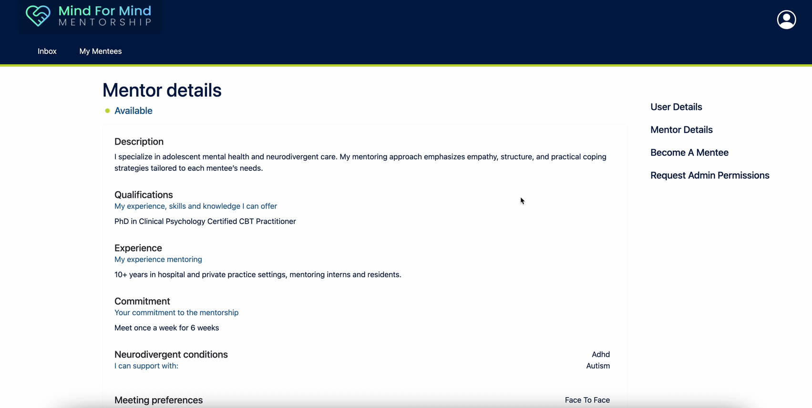
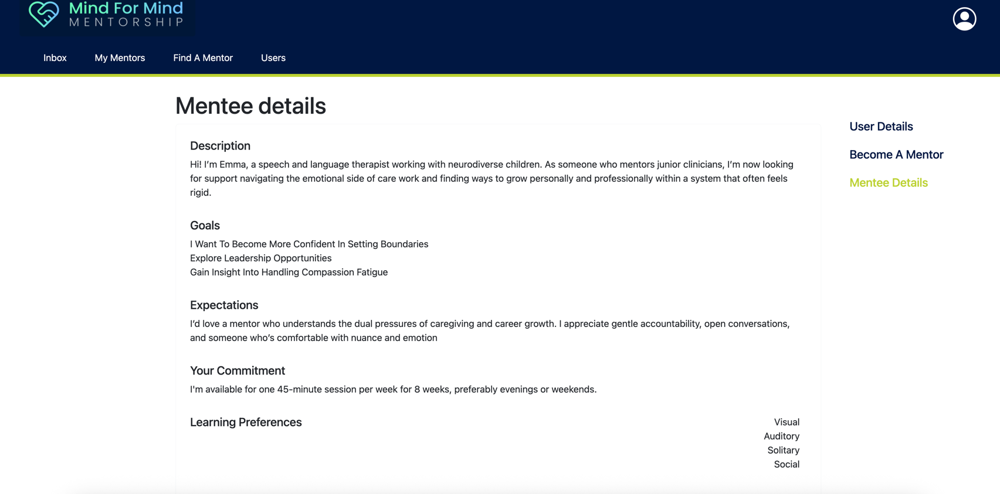

# Mind4MindsApp

Welcome to Minds for minds, the app that connects mentees to mentors with neurodiverse considerations.

Feel free to use the [production ready](https://mind-4-minds.web.app/) version of the app

## User rules
- User can update their details including email, name and passwords as long they remember their current password
- Only admins can reset passwords at this stage
- Can request to be an admin but this must be approved by an approved admin

## Mentor Tutorial
Mentors will receive request for mentorship from mentees and can:
- Accept the request
- Decline the request
- Ignore the request
- View the mentee's mentorship details
- End a mentorship with a mentee
- Remove themselves from the list of active mentors

[Watch the mentor tutorial](tutorials/mentor_tutorial.mov)

<details>
  <summary>Click to see screenshots from a mentor's POV</summary>

The mentor's current mentees


The mentor's inbox


A mentorship request



Mentor details

</details>

## Mentee Tutorial

Mentees will search for mentors and make mentorship requests to mentors. They can also:

- View the mentor's mentorship details
- End a mentorship with a mentor

[Watch the mentee tutorial](tutorials/mentee_tutorial.mov)

<details>
  <summary>Click to see screenshots from a mentee's POV</summary>

The mentee's current mentors


Mentee searching for a mentor


Mentee details



</details>

## Local Development
To run the app locally, you must have installed:
- Python 3.14
- Node.js
- Pipenv
- PostgreSQL

## Backend setup

Create a PostgresSQL user:
```bash
sudo -u postgres createuser --interactive --pwprompt
```

Then provide the following when prompted:

```bash
Enter name of role to add: mind_for_minds
Enter password for new role: <choose a password>
Enter it again: <repeat password>
Shall the new role be a superuser? (y/n) n
```
Create the PostgresSQL database:

```bash
sudo -u postgres createdb -O mind_for_minds mind_for_minds_db
```
After creating the db run:

```bash
sudo -u postgres psql -c "ALTER ROLE mind_for_minds CREATEDB;"
```

Create a .env file inside the backend directory with the following values:

- ENV=dev
- SECRET_KEY=your-generated-django-secret-key
- DB_USER=mind_for_minds
- DB_PASSWORD=your-postgres-password
- DB_HOST=localhost
- DB_PORT=5432

DB_PASSWORD should be the password for the mind_for_minds PostgreSQL user.

Install the backend dependencies:
```bash
cd backend
```
```bash
pipenv install --dev
```

Generate a Django secret key with:

```bash
pipenv run python -c "from django.core.management.utils import get_random_secret_key; print(get_random_secret_key())"
```

Copy the generated value into SECRET_KEY in .env.

Apply the database migrations:

```bash
pipenv run python manage.py migrate
```

Run the backend tests with:

```bash
pipenv run pytest
```

## Local Server
To run the application locally, run `npm run dev`

To the run the frontend locally, run the following commands in the terminal:
```bash
cd frontend
```
```bash
ng serve
```

To run the backend locally, run the following commands in the terminal:
```bash
cd backend
```
```bash
pipenv run python manage.py runserver
```

## Some features are currently not implemented
This includes:
- Notifications
- Emails


